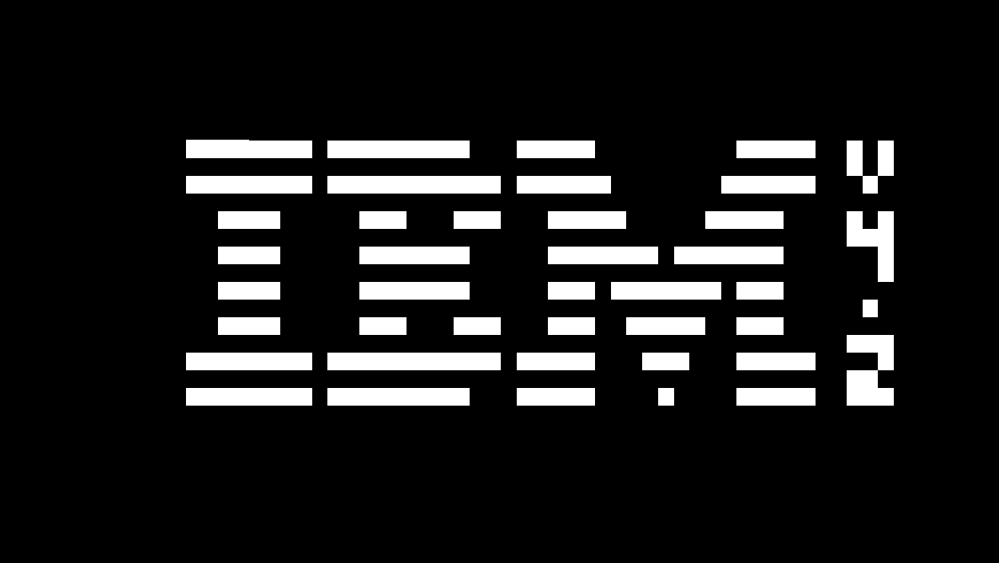

<div align="center">

# Chip-8 
*An emulator for the **CHIP-8**, **SUPER-CHIP**, and **XO-CHIP** platforms, developed in C++.*

</div>

| | | |
| :---: | :---: | :---: |
|  |  |  |
|  |  |  |

## Key Features

Passes the complete [Timendus test suite](https://github.com/Timendus/chip8-test-suite)
* **Full Instruction Set Support:** Exhaustive implementation of all opcodes for **CHIP-8**, **SUPER-CHIP (S-CHIP)**, and **XO-CHIP**.
* **Faithful Audio:** Accurate audio emulation integrated via the [miniaudio](https://miniaud.io/) library.
* **Built-in Debugger:** Advanced debug interface for real-time analysis of the emulator state:
    * **Disassembler:** Real-time visualization of the executing machine code.
    * **RAM Monitor:** Live inspection of the system memory.
    * **Registers:** Monitoring of CPU register states at every cycle.
* **Rendering:** **OpenGL** (via **GLAD** ) and window/input management via **GLFW**.

## Technical Stack

* **Language:** C++
* **Graphics:** [OpenGL](https://www.opengl.org/)
* **API Loader:** [GLAD](https://glad.dav1d.de/)
* **Windowing & Input:** [GLFW](https://www.glfw.org/)
* **Audio:** [miniaudio](https://miniaud.io/)

### Prerequisites
* A C++ compiler supporting C++20 or higher.
* [CMake](https://cmake.org/).

### Building
1. Clone the repository:
   ```bash
   git clone [https://github.com/your-username/your-project.git](https://github.com/your-username/your-project.git)
   git submodule update --init --recursive
   cd your-project
2. Build:
   ```bash
   cd chip8/
   make

Contributions are welcome! If you have any suggestions, improvements, or bug reports, feel free to open an "Issue" or submit a "Pull Request". Any feedback is highly appreciated!
