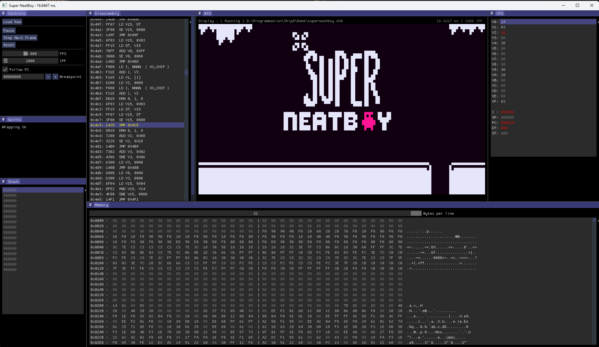
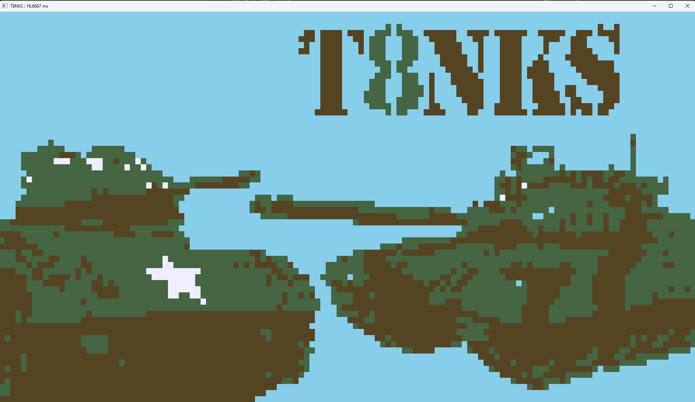
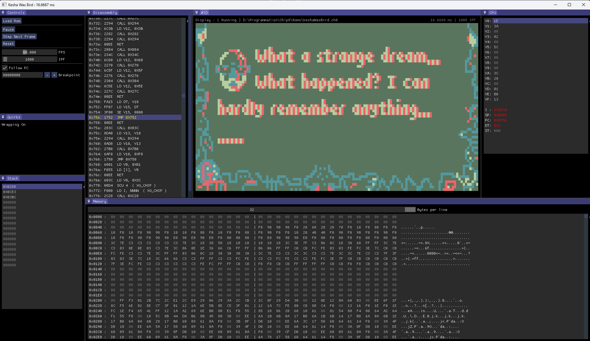
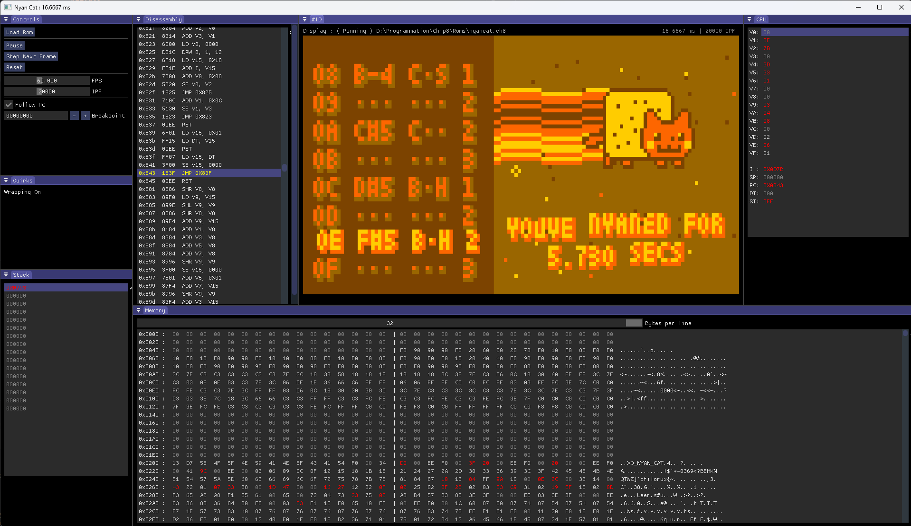
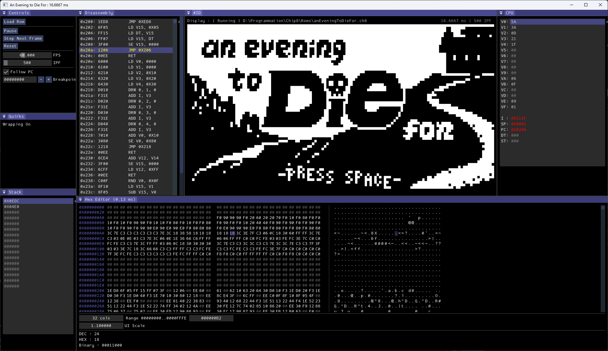
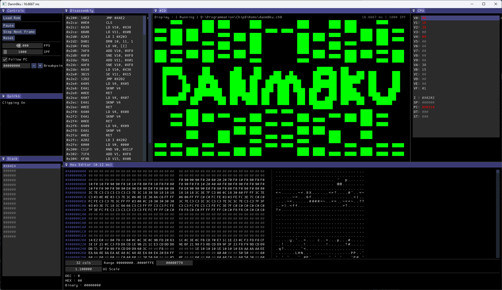

<div align="center">

# Chip-8 
*An emulator for the **CHIP-8**, **SUPER-CHIP**, and **XO-CHIP** platforms, developed in C++.*
*This project is cross-platform and supports both Windows and Linux.*

</div>

| | | |
| :---: | :---: | :---: |
|  |  |  |
|  |  |  |

## Key Features

Passes the complete [Timendus test suite](https://github.com/Timendus/chip8-test-suite)
* **Full Instruction Set Support:** Exhaustive implementation of all opcodes for **CHIP-8**, **SUPER-CHIP (S-CHIP)**, and **XO-CHIP**.
* **Configurable Quirks**: Highly adaptable CPU behavior to ensure maximum compatibility with the wide variety of legacy ROMs.
* **Database Integration:** ( https://github.com/chip-8/chip-8-database )    
Connects to the CHIP-8 Database to automatically adjust:
   - Tickrate: Optimized timing for each specific game.
   - Display: Accurate resolution and color palettes.
   - Input Mapping: Custom control schemes per ROM.
* **Flexible Display Modes**:
DEBUG_INFO flag: Switch between built-in debugger view and full screen.
* **Faithful Audio:** Accurate audio emulation integrated via the [miniaudio](https://miniaud.io/) library.
* **Built-in Debugger:** Advanced debug interface for real-time analysis of the emulator state:
    * Disassembler: Real-time visualization of the executing machine code.
    * RAM Monitor: Live inspection of the system memory.
    * Registers: Monitoring of CPU register states at every cycle.
    * Breakpoint Edition.
* **Rendering:** **OpenGL** (via **GLAD** ) and window/input management via **GLFW**.

## Technical Stack

* **Language:** C++
* **Graphics:** [OpenGL](https://www.opengl.org/)
* **API Loader:** [GLAD](https://glad.dav1d.de/)
* **Windowing & Input:** [GLFW](https://www.glfw.org/)
* **Audio:** [miniaudio](https://miniaud.io/)

### Prerequisites
* A C++ compiler supporting C++20 or higher.
* [CMake](https://cmake.org/).
* VLD ( If you wish to use Visual Leak Detector ( VLD ) to track memory leaks, you can enable it by passing the -LEAK_DETECTOR_ENABLE=ON flag during the CMake configuration step. The CMakeLists.txt is configured to handle the integration automatically )

### Building
1. Clone the repository:
   ```bash
   git clone https://github.com/Nedriia/Chip8.git
   cd Chip8
   git submodule update --init --recursive
2. Build:
   ```bash
   cd build
   make
